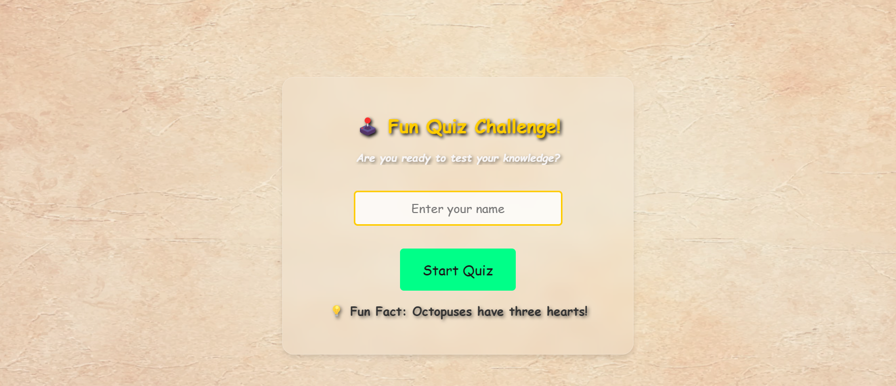
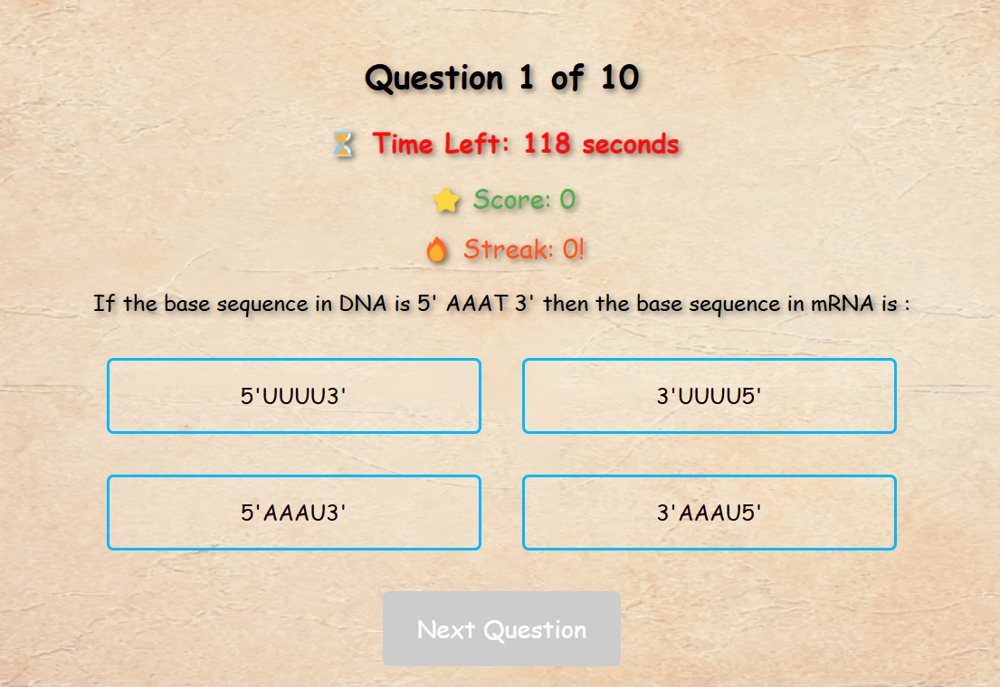
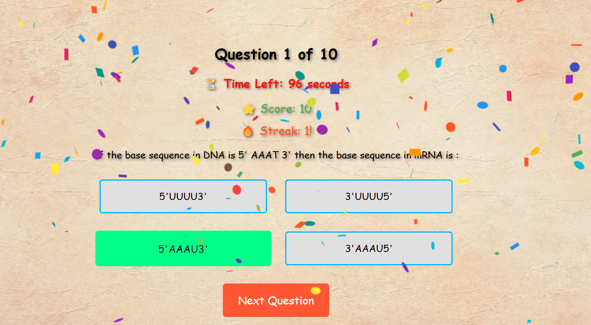

# 🎩 Fun Quiz Challenge

A fun and interactive quiz app built with **React.js**. This app allows users to test their knowledge in a gamified experience, featuring sound effects, animations, avatar selection, and confetti celebrations for high scores! 🎉

---

## 🌟 Features

✅ **Home Screen**
- Name input to personalize the experience
- Random fun fact displayed with a typing effect
- Avatar selection for a unique identity
- Smooth transitions and sound effects
- Start music for a better interface

✅ **Quiz Section**
- Multiple-choice questions
- Clap sound effect for correct answers
- Beep sound for wrong answers
- Click sound effect on button clicks
- User-friendly interface

✅ **Results Page**
- Displays user's score and performance message
- Confetti animation for high scores
- Option to retake the quiz
- Celebration upon achieving high scores

---

## 🚀 Getting Started

### **1⃣ Clone the Repository**
```sh
git clone https://github.com/yourusername/quiz-app.git
cd quiz-app
```

### **2⃣ Install Dependencies**
```sh
npm install
```

### **3⃣ Start the Application**
```sh
npm start
```
This will start the development server at `http://localhost:3000/`.

---

## 🛠️ Tech Stack

- **React.js** – Frontend framework
- **React Router** – Navigation between pages
- **useSound** – Sound effects
- **React Confetti** – Celebration effect
- **Framer Motion** – Smooth animations

---

## 💁️ Avatar Selection

Users can choose from multiple avatars to personalize their quiz experience. Available options include:
- 🧜 Superhero
- 👩‍🚀 Astronaut
- 🧙 Wizard

---

## 💂️ Gamification Elements
- 🎉 **Confetti celebration** on high scores
- 👏 **Clap sound effect** for correct answers
- ✅ **Smooth animations** for UI transitions

---

## 📁 Project Structure
```
📺 quiz-app
 └─ src
   ├─ components
   │  ├─ Home.js
   │  ├─ Quiz.js
   │  └─ Results.js
   ├─ styles
   ├─ Images
   │  
   ├─ App.js
   └─ index.js
```

---

## 📝 Dependencies
```json
"dependencies": {
  "axios": "^1.7.9",
  "framer-motion": "^12.0.6",
  "react": "^19.0.0",
  "react-canvas-confetti": "^2.0.7",
  "react-confetti": "^6.2.2",
  "react-router-dom": "^7.1.5",
  "react-scripts": "5.0.1",
  "use-sound": "^4.0.3"
}
```

---

## Screen Shots





---

## 🎥 Demo Video  
[](https://drive.google.com/file/d/1XCiP1-ERvmrltSCouAuzB4Ejr8ZGomcS/view?usp=sharing))

---

## 🌐 Live Website  
Visit the app at: [quizsujith.netlify.app](https://quizsujith.netlify.app)

---

## 👨‍💻 Author
- **Sujith Kurisetti**
- GitHub: [Your GitHub Profile](https://github.com/kurisettisaisujith)

--- 


